# 基于ESP8266改造普通灯变成WiFi控制灯\*\*

\-------------------------------------------------------------------------------------------------------

1.  项目目的

改造普通灯变成WiFi控制灯，在同一WlAN环境下直接通过手机操控开灯与关灯。

1.  **项目环境**

    1.  NodeMCU（ESP8266）开发板一块

        1.  延时时间高低电平继电器模块一个

        2.  220v转12v/5v/3.3v输出模块一个

        3.  普通USB灯一个

        4.  杜邦线若干

        5.  手机一台

        6.  Arduino IDE开发环境

        7.  VS code 开发环境

2.  **项目原理**

3.  **继电器控制原理**

    电磁式继电器一般由铁芯、线圈、衔铁、触点簧片等组成的。只要在线圈两端加上一定的电压，线圈中就会流过一定的电流，从而产生电磁效应，衔铁就会在电磁力吸引的作用下克服返回弹簧的拉力吸向铁芯，从而带动衔铁的动触点与静触点（常开触点）吸合，形成闭合回路。当线圈断电后，电磁的吸力也随之消失，衔铁就会在弹簧的反作用力返回原来的位置，使动触点与原来的静触点（常闭触点）释放，切断电路。通过吸合、释放，从而达到了在电路中的导通、切断且不直接接触开关的目的。

4.  **ESP8266模块原理**

    ESP8266是一款超低功耗的UART-WiFi 透传模块, 可将用户的物理设备连接到Wi-Fi
    无线网络上,进行互联网或局域网通信,实现联网功能。ESP8266的开发方式有这几种:
    1、AT指令方式
    ，烧录AT的固件包，使用AT指令与ESP8266交互，执行相应指令，需与单片机相连2、NodeMCU的lua开发，烧录NodeMCU的固件包，使用Lua语言开发，使用ESP内部资源。3、Arduino
    IDE下的开发，直接编写固件，编译之后，烧录进ESP，使用ESP内部资源。

5.  **HTTP/HTTPS服务器程序原理**

    超文本传输协议（HTTP：Hypertext Transport
    Protocol）是万维网应用层的协议，通过两个程序实现：一个是客户端程序（各种浏览器），另一个是服务器
    （常称Web服务器）。这两个通常运行在不同的主机上，通过交换报文来完成网页请求和响应，报文可简单分为请求报文和响应报文。

    客户机与服务器建立连接后，浏览器可以向web服务器发送请求并显示收到的网页，当用户在浏览器地址栏中输入一个URL或点击一个超连接时，浏览器就向服务器发出了HTTP请求，请求方式的格式为：统一资源标识符、协议版本号，后边是MIME（Multipurpose
    Internet Mail
    Extensions）信息包括请求修饰符、客户机信息和可能的内容。该请求被送往由URL指定的WEB服务器，WEB服务器接收到请求后，进行相应反映，其格式为：一个状态行包括信息的协议版本号、一个成功或错误的代码，后边服务器信息、实体信息和可能的内容。即以HTTP规定的格式送回所要求的文件或其他相关信息，再由用户计算机上的浏览器负责解释和显示。

6.  网站图形化控制\*\*

    Html
    是超文本标记语言，主要用于做网页，可以在网页上显示文字、图像、视频、声音。提供一个图形化的页面提供用户操作。

7.  **项目步骤与结果**

8.  **连接电路**

    根据电路连接设计图进行电路连接：

    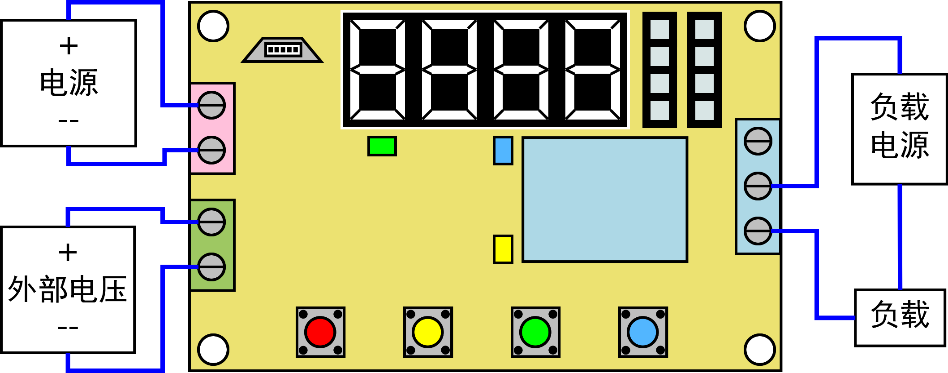

    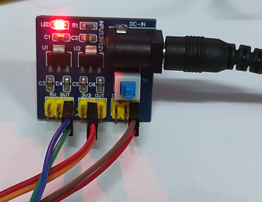

    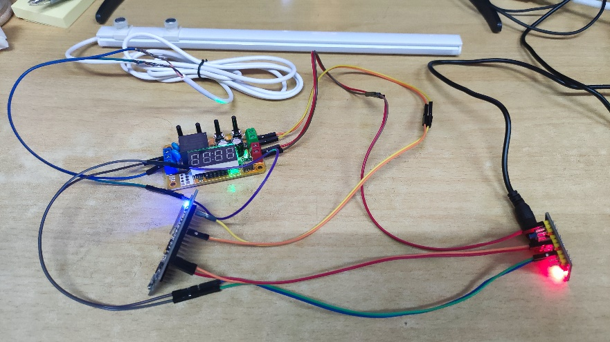

    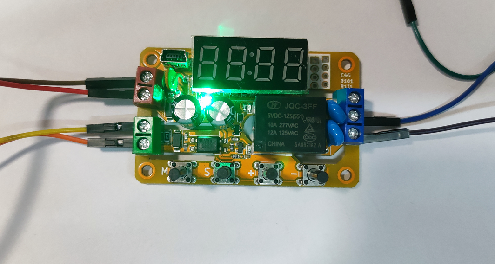

9.  **设置继电器模式**

    继电器模式选择延时模式，并设置编号0000，设置继电器为高电平接通，低电平断开。

| 名称 | 数码管显示                                          | 意义          |
|------|-----------------------------------------------------|---------------|
| F--0 |  | 输入输出模式  |
| F--1 |  | 延时功能选择  |
| P--A |  | 延时时间参数A |
| P--C |  | 延时时间参数C |
| P--L |  | 循环计数参数L |

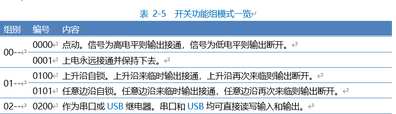

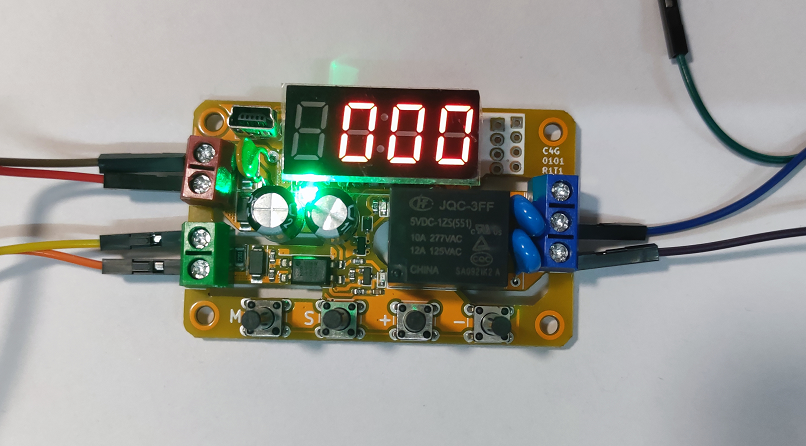

1.  **通过arduino IDE 编写NodeMCU程序**

2.  编写程序前需要安装好NodeMCU的串口驱动模块，驱动安装程序在Github中。

    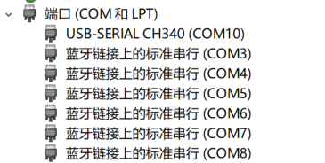

    图中COM10为NodeMCU模块串口

3.  打开Arduino

    IDE-\>菜单项文件-\>首选项，然后会看到附加开发版管理器网址，填入http://arduino.esp8266.com/stable/package_esp8266com_index.json，重启IDE；

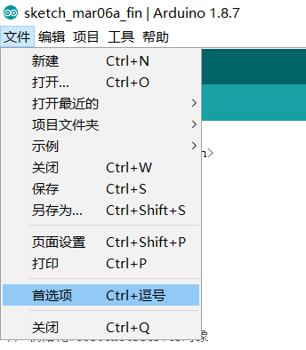

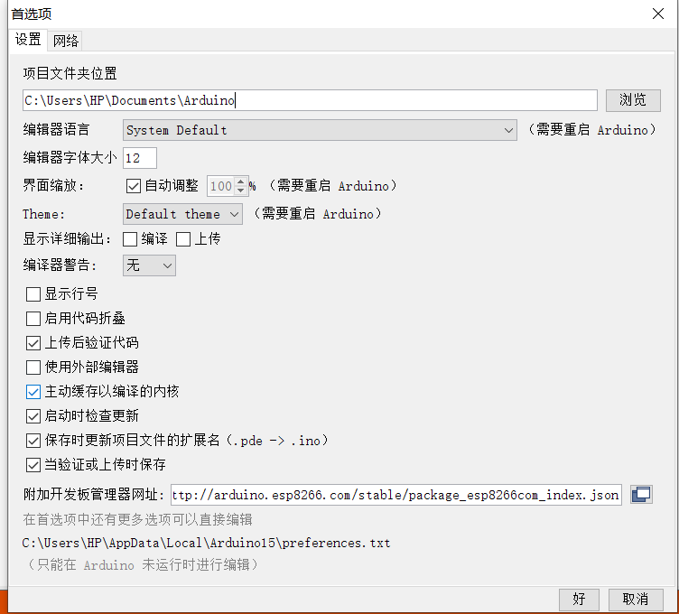

1.  在arduino中设置串口

    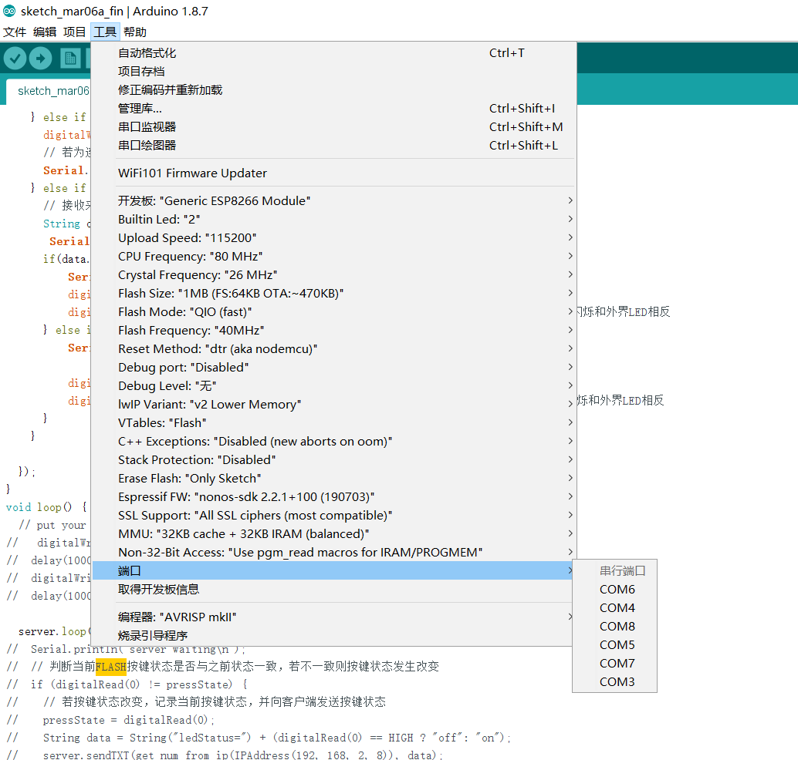

2.  添加ESP8266库

    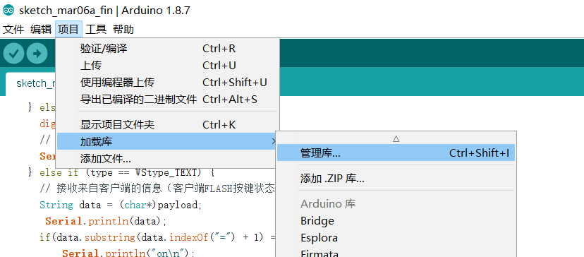
    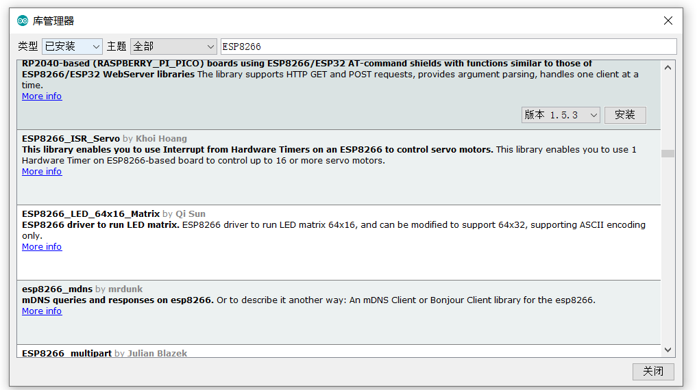

3.  **引入库**

    \#include \<ESP8266WiFi.h\> // 本程序使用 ESP8266WiFi库

    \#include \<ESP8266WiFiMulti.h\> // ESP8266WiFiMulti库

    \#include \<ESP8266WebServer.h\> // ESP8266WebServer库

    ESP8266WiFiMulti wifiMulti; //
    建立ESP8266WiFiMulti对象,对象名称是'wifiMulti'

    ESP8266WebServer esp8266_server(80);

    // 建立SP8266WebServer对象，对象名称为esp8266_server

    // 括号中的数字是网路服务器响应http请求的端口号

    // 网络服务器标准http端口号为80，使用80为端口号

4.  **设置初始化**

    // 服务器首页

    String html = “xxx”;

    // 开灯

    String ophtml= “xxx”;

    // 关灯

    String clhtml= “xxx”;

    void setup(void)

    {

    Serial.begin(115200); // 启动串口通讯

    //通过addAp函数存储 WiFi名称 WiFi密码

    wifiMulti.addAP("TP-LINK_6472", "gdcjdx105");

    // 这三条语句通过调用函数addAP来记录3个不同的WiFi网络信息.

    wifiMulti.addAP("realme_k30", "88888888");

    wifiMulti.addAP("SDFFFF", "13572468");

    }

    digitalWrite(2, HIGH);

    while (wifiMulti.run() != WL_CONNECTED)

    {

    //
    此处的wifiMulti.run()是重点。通过wifiMulti.run()，NodeMCU将会在当前环境中搜索addAP函数所存储的WiFi。如果搜到多个存储的WiFi那么NodeMCU将会连接信号最强的那一个WiFi信号。

    delay(1000);

    Serial.print(i++);

    Serial.print(' ');

    }

    //
    一旦连接WiFI成功，wifiMulti.run()将会返回“WL_CONNECTED”。这也是digitalWrite(2,
    LOW); // 此处while循环判断是否跳出循环的条件。

5.  **启动网络服务功能**

    esp8266_server.begin();

    esp8266_server.on("/", handleRoot);

    //设置服务器根目录为/ 访问时调用handleroot

    esp8266_server.on("/pin", HTTP_GET, pin);

    //访问pin时 模式为传参模式 调用pin

    esp8266_server.onNotFound(handleNotFound);

    //处理访问不存在位置时 调用Notfound

6.  **处理网站根目录“/”的访问请求**

    Serial.println("HTTP esp8266_server started");

    // 告知用户ESP8266网络服务功能已经启动

    void handleRoot()

    {

    //处理网站根目录“/”的访问请求

    esp8266_server.send(200, "text/html", html);

    // NodeMCU将调用此函数。

    }

    // 设置处理404情况的函数'handleNotFound'

    void handleNotFound()

    { // 当浏览器请求的网络资源无法在服务器找到时，

    esp8266_server.send(404, "text/plain", "404: Not found");

    // NodeMCU将调用此函数。

    }

7.  **设置循环函数，处理http服务器访问**

    void loop(void)

    {

    esp8266_server.handleClient(); // 处理http服务器访问

    }

8.  **详情代码链接**

    [ESP8266-Wifi-led/Arduino-file/ESP8266-Wifi-led-Server at main ·
    Kindly-bit/ESP8266-Wifi-led
    (github.com)](https://github.com/Kindly-bit/ESP8266-Wifi-led/tree/main/Arduino-file/ESP8266-Wifi-led-Server)

    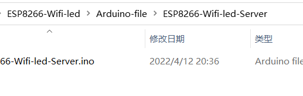

9.  **编写HTTP/HTTPS服务器程序**

    //--------"启动网络服务功能"程序部分开始-------- //

    esp8266_server.begin();

    esp8266_server.on("/", handleRoot); //设置服务器根目录为/
    访问时调用handleroot

    esp8266_server.on("/pin", HTTP_GET, pin); //访问pin时 模式为传参模式 调用pin

    esp8266_server.onNotFound(handleNotFound); //处理访问不存在位置时
    调用Notfound

10. **添加继电器控制功能。**

    void pin()//访问pin

    {

    if (esp8266_server.arg("light1") == "1")

    {

    digitalWrite(05, LOW); // D1

    Serial.println("2-0");

    esp8266_server.send(200, "text/html", ophtml);

    } // 2端口

    else if (esp8266_server.arg("light1") == "0")

    {

    digitalWrite(05, HIGH); // D1

    Serial.println("2-1");

    esp8266_server.send(200, "text/html", clhtml);

    }

    }

11. **编写具有发送HTTP/HTTPS功能的服务器网页**

    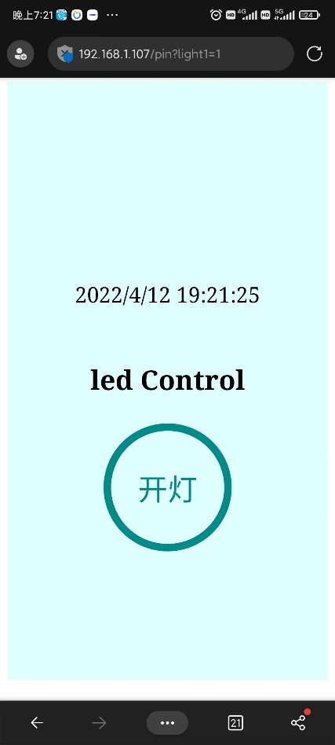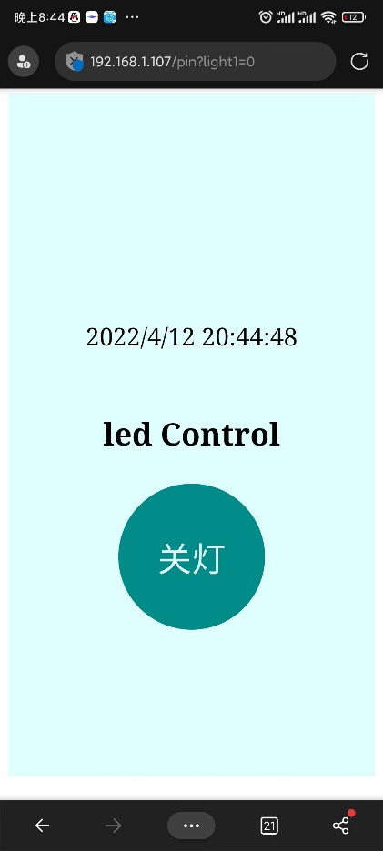

    [ESP8266-Wifi-led/html-file at main · Kindly-bit/ESP8266-Wifi-led
    (github.com)](https://github.com/Kindly-bit/ESP8266-Wifi-led/tree/main/html-file)

    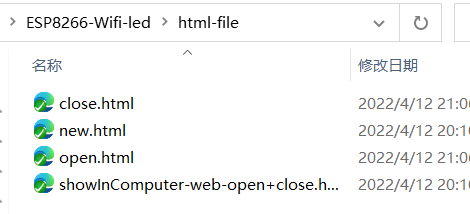

12. **烧录程序**

    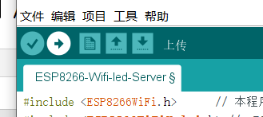

    
    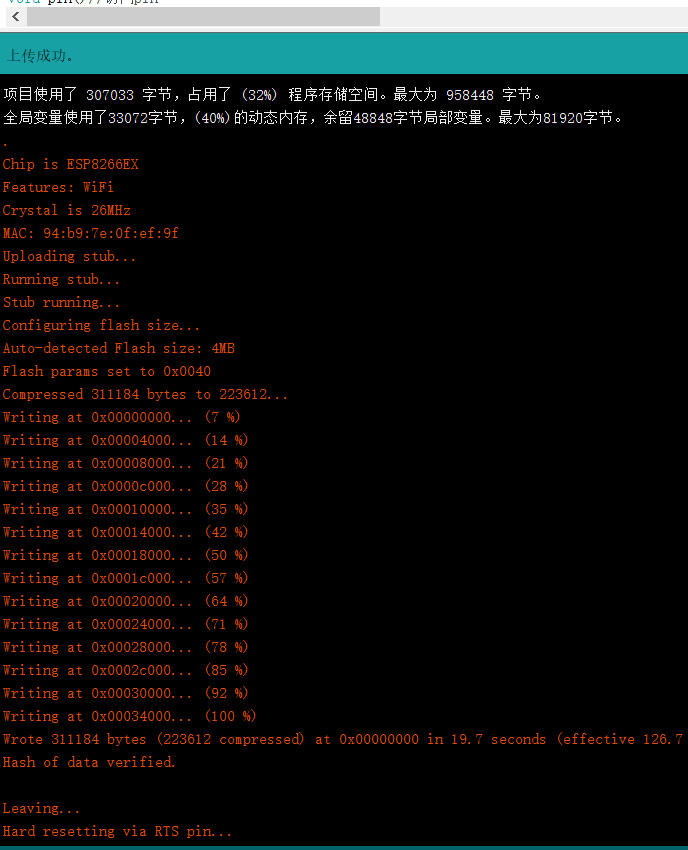

13. **测试程序**

    打开串口监视器：

    连接到TP-LINK_6472

    获取到IP地址为 192.168.1.107

    2-1：开灯

    2-0：关灯

    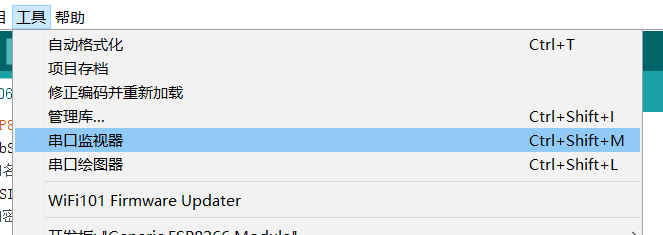

    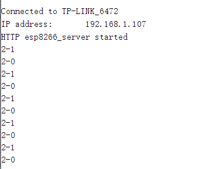

14. **通过手机通过ip地址向服务器发起申请，通过图形化界面控制开灯关灯，传输指令。**

    成功通过点击按钮操控电灯

    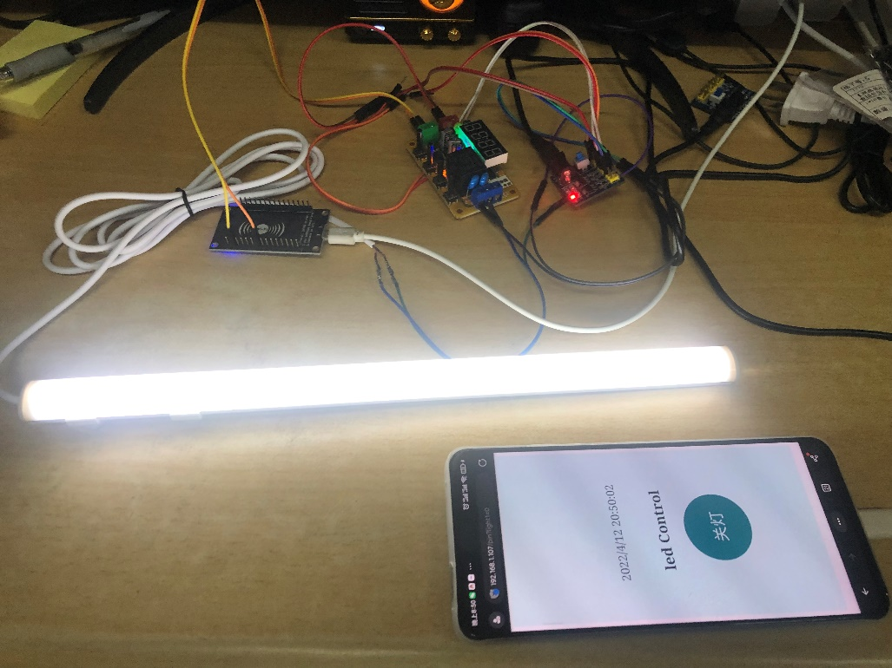

    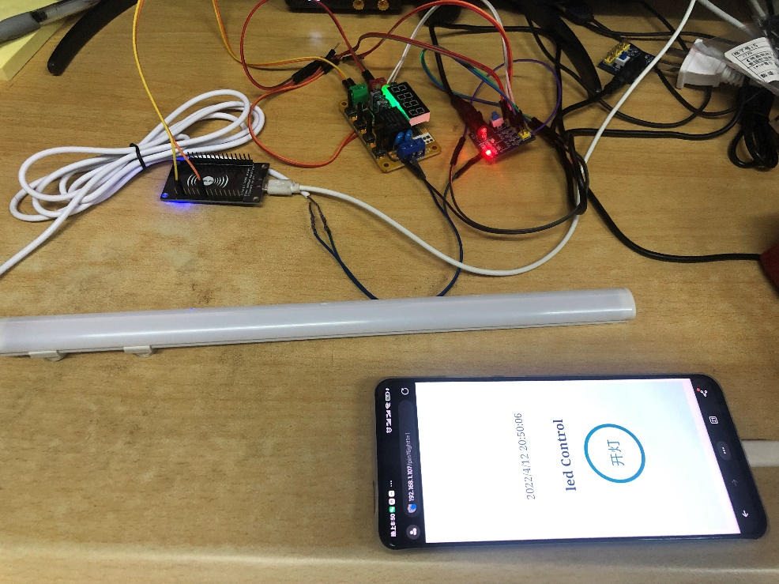

15. **项目总结**

16. 实验结果评价

本次实验涉及到许多未曾涉及过的领域，需要搜索各个硬件的使用说明以及样例。该项目完成了搭建服务器，响应网页请求，搭建较好的网页交互效果，根据请求操作设置高电平修改继电器，形成回路电亮电灯，完成了对该项目的实验要求。

1.  实验中遇到的主要问题的分析与处理：

2.  Wifi模块接入电路后，开灯关灯操作引发电灯频闪：

尝试调整继电器模式，改成上升电压进行一次开灯或关灯，依旧有频闪现象。尝试接入其他电源为ESP8266供电，频闪现象消失，分析得电源负载过高导致电流不稳定。因此改用usb供电。

1.  用Arduino IDE开发时插入html网页：

常用插入html网页方式为存放html文件在同一文件夹当中，client申请访问时进行调用。但是Arduino不提供文件夹烧录。查找多篇文章，均为字符化压缩的html文件内容。因此放弃采用动态的网页形式。改用静态网页，后面查找到可以使用flash存入内存，考虑到ESP8266内存较小，后面还是采用静态网页。

1.  手机控制开灯方式：

本次实验前期使用websocket将电脑与ESP8266模块进行连接，该方法为使用ESP8266作为服务器，电脑作为client，为ESP8266固定ip地址，通过连接ESP8266的AP模式所发出的wifi，在同一WLAN中向固定ip发起连接。发送指令，能轻松操控ESP8266端口进行高低电平修改。考虑到要用手机进行连接，因此要编写app进行操作。考虑到这种方式每次连接都需要下载app或者要打开idex.html文件。因此放弃这个思路，改用浏览器访问方式进行操控。最终结果为使用wifi构建同一WLAN，使用浏览器进行访问。

1.  通过互联网对电灯进行操作

目前方法是基于WLAN内分配ip，无法通过互联网访问该ip。一般通过互联网进行物联网操作分成两种方法，一是子网穿透，二是使用物联网平台。由于成本较高，因此本次实验不接入公网。

参考：

[esp8266 用arduino
ide用网页控制led_sxper的博客-CSDN博客](https://blog.csdn.net/sxper/article/details/90321587?ops_request_misc=&request_id=&biz_id=102&utm_term=esp8266%20%E7%BD%91%E7%AB%99%20arduino&utm_medium=distribute.pc_search_result.none-task-blog-2~all~sobaiduweb~default-5-90321587.142%5ev7%5epc_search_result_control_group,157%5ev4%5econtrol&spm=1018.2226.3001.4187)

[ESP8266+搭建迷你小网站_Ti多芬的博客-CSDN博客_esp8266建个人网站](https://blog.csdn.net/qq_46292418/article/details/106507543?spm=1001.2014.3001.5502)

[ESP8266+网页控制LED_Ti多芬的博客-CSDN博客_esp8266网页控制led](https://blog.csdn.net/qq_46292418/article/details/106605366?spm=1001.2014.3001.5502)

[基于Arduino
用Esp8266烧录Html文件，实现手机电脑访问内置网页控制设备开和关（一）！_梅晌的博客-CSDN博客_arduino
html](https://blog.csdn.net/weixin_44301884/article/details/89421699)

[ESP8266使用WebSocket协议_丶苍炎战神丶的博客-CSDN博客_esp8266
websocket](https://blog.csdn.net/yq543858194/article/details/109186301)

[villivateur/IoT_Switch: 基于ESP8266和Arduino的Socket内网穿透控制客户端
(github.com)](https://github.com/Villivateur/IoT_Switch)
